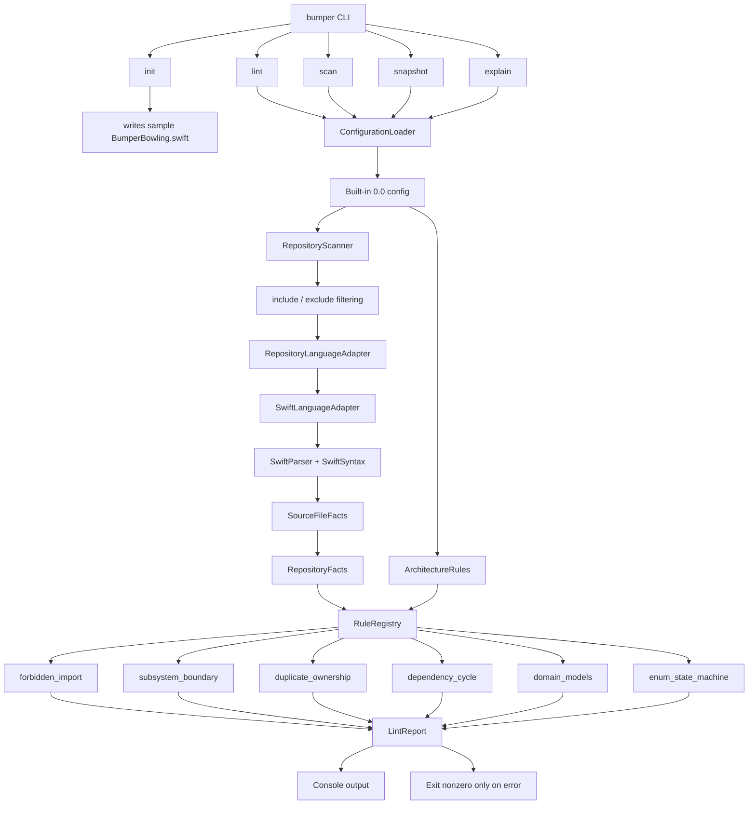
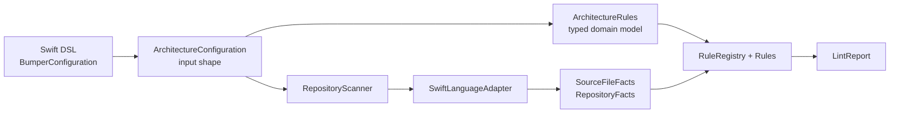
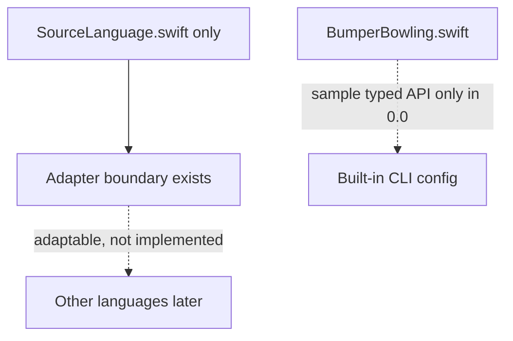
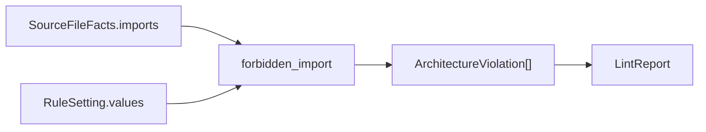
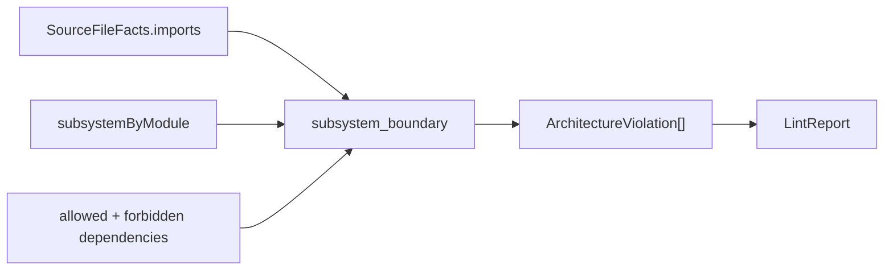
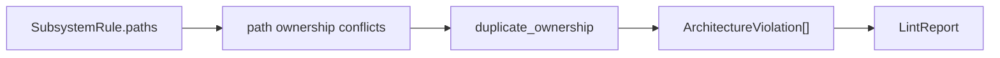
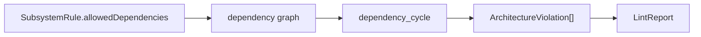
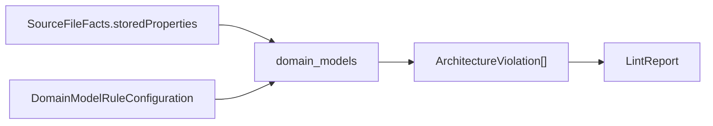
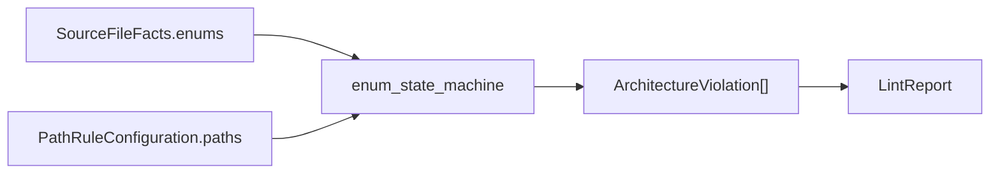

# Bumper Bowling Architecture Snapshot

Generated by `bumper snapshot`. Do not edit this file by hand; update the generator or architecture metadata instead.

Bumper Bowling is a tiny, syntax-first architecture linter. The 0.0 system has a real adapter boundary, but Swift is the only language surface.

## Command Flow

## Conceptual Layers

## 0.0 Boundaries

## Enabled Rules

- `forbidden_import`: Disallows configured imports in linted source files.
- `subsystem_boundary`: Requires subsystem imports to match declared dependencies.
- `duplicate_ownership`: Disallows duplicate subsystem path and module ownership.
- `dependency_cycle`: Disallows cycles in configured subsystem dependencies.
- `domain_models`: Applies configured domain-model taste rules.
- `enum_state_machine`: Requires parser files to declare an enum state machine.

## Rule Snapshots

### `forbidden_import`

### `subsystem_boundary`

### `duplicate_ownership`

### `dependency_cycle`

### `domain_models`

### `enum_state_machine`

## Summary

The CLI loads configuration, the scanner turns Swift files into facts through the Swift adapter, the rule registry evaluates typed rules against typed facts, and the report prints plain console output. The design keeps parsing isolated from lint rules while avoiding extra language surfaces until they are real.
