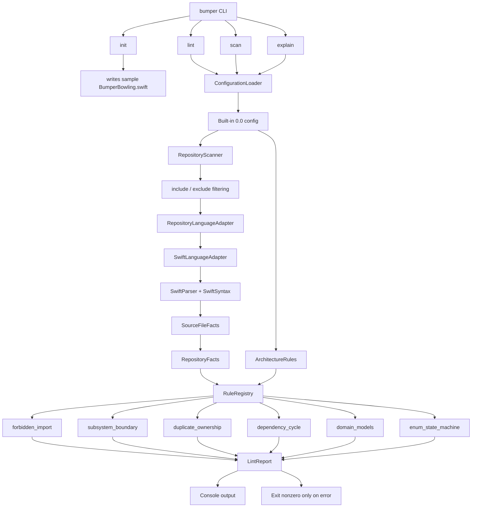
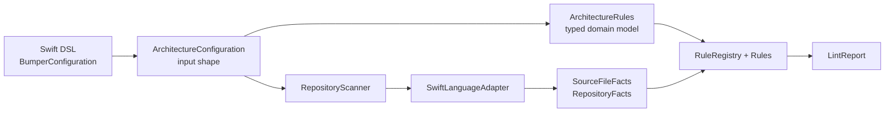
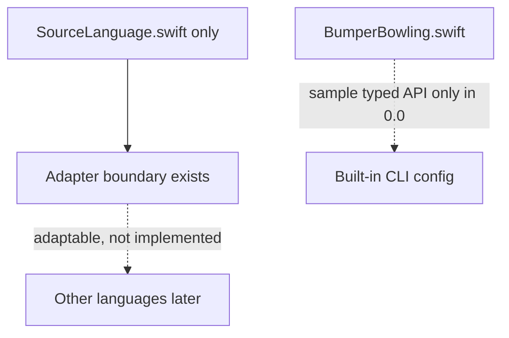

# Bumper Bowling System Diagram

Bumper Bowling is a tiny, syntax-first architecture linter. The 0.0 system has a real adapter boundary, but Swift is the only language surface.

## Command Flow

## Conceptual Layers

## 0.0 Boundaries

## Summary

The CLI loads configuration, the scanner turns Swift files into facts through the Swift adapter, the rule registry evaluates typed rules against typed facts, and the report prints plain console output. The design keeps parsing isolated from lint rules while avoiding extra language surfaces until they are real.
