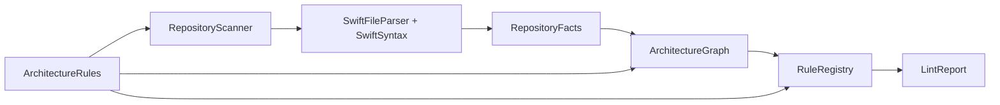
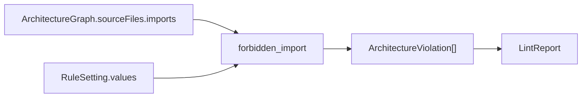
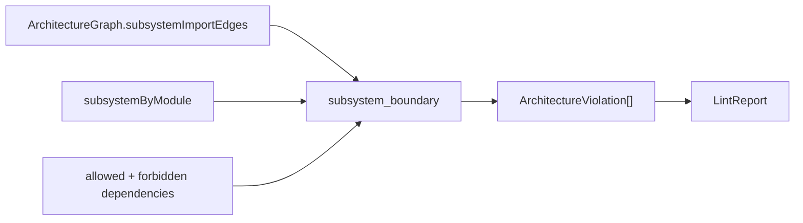
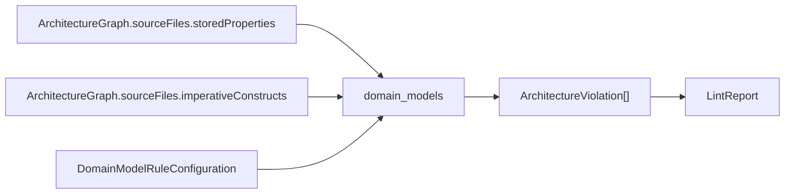
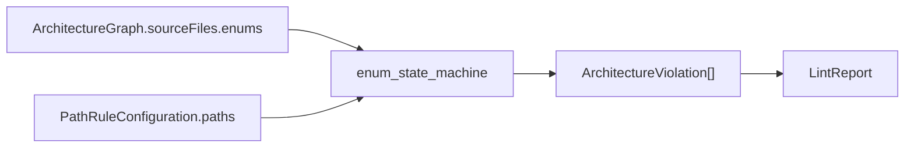

# Bumper Bowling Architecture Snapshot

Generated by `bumper snapshot`. Do not edit this file by hand; update the generator or architecture metadata instead.

Bumper Bowling is a tiny Swift DSL for asserting architecture over SwiftSyntax-observed source facts.

## Commands

- `bumper init`
- `bumper lint`
- `bumper scan`
- `bumper snapshot`
- `bumper explain`

## Pipeline

## Rule Snapshots

### `forbidden_import`

Disallows configured imports in linted source files.

### `subsystem_boundary`

Requires subsystem imports to match declared dependencies.

### `duplicate_ownership`

Disallows duplicate subsystem path and module ownership.

### `dependency_cycle`

Disallows cycles in configured subsystem dependencies.

### `domain_models`

Applies configured domain modeling assertions.

### `enum_state_machine`

Requires parser files to declare an enum state machine.

