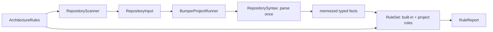
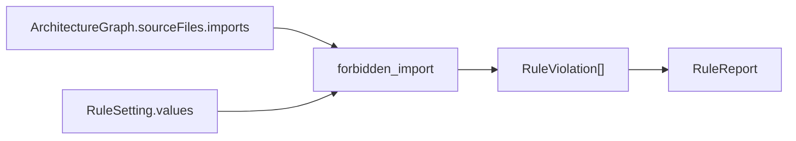
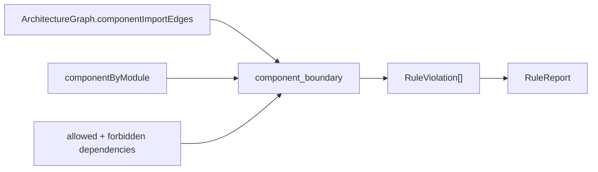
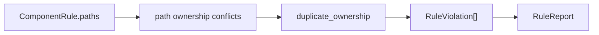
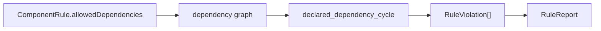
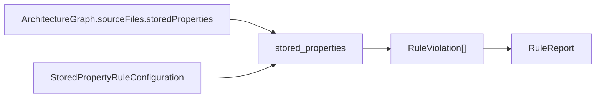
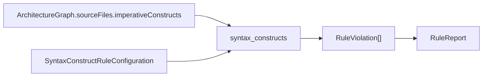
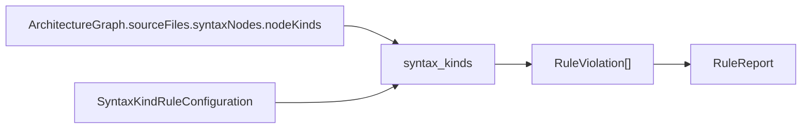
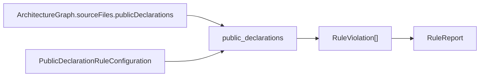

# Bumper Bowling Architecture Snapshot

Generated by `bumper snapshot`. Do not edit this file by hand; update the generator or architecture metadata instead.

Bumper Bowling asserts architecture over SwiftSyntax-observed source facts, configured in familiar Swift.

## Commands

- `bumper init`
- `bumper lint`
- `bumper test`
- `bumper scan`
- `bumper baseline`
- `bumper snapshot`
- `bumper config`
- `bumper explain`

## Pipeline

## Rule Snapshots

### `forbidden_import`

Disallows configured imports in linted source files.

### `component_boundary`

Requires component imports to match declared dependencies.

### `duplicate_ownership`

Disallows duplicate component path and module ownership.

### `declared_dependency_cycle`

Disallows cycles in declared component dependencies.

### `stored_properties`

Applies configured assertions over SwiftSyntax stored property facts.

### `syntax_constructs`

Applies configured assertions over SwiftSyntax construct facts.

### `syntax_kinds`

Applies configured assertions over observed SwiftSyntax node kinds.

### `public_declarations`

Applies configured assertions over public declaration facts.

